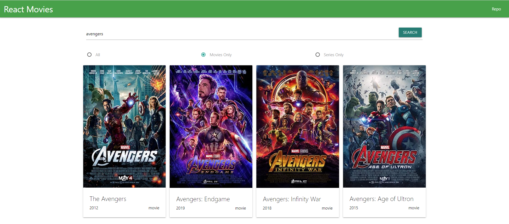

# Приложение по поиску фильмов/сериалов на React и Materialize CSS

-   Названия следует писать на английском языке

**Для запуска приложения на локальном устройстве необходимо скачать репорзиторий и выполнить в терминале следующие команды**

-   Установить зависимости `npm i`
-   Запустить режим разработки `npm start`

**Для запуска финальной сборки проекта**
Выполнить `npm run build`

