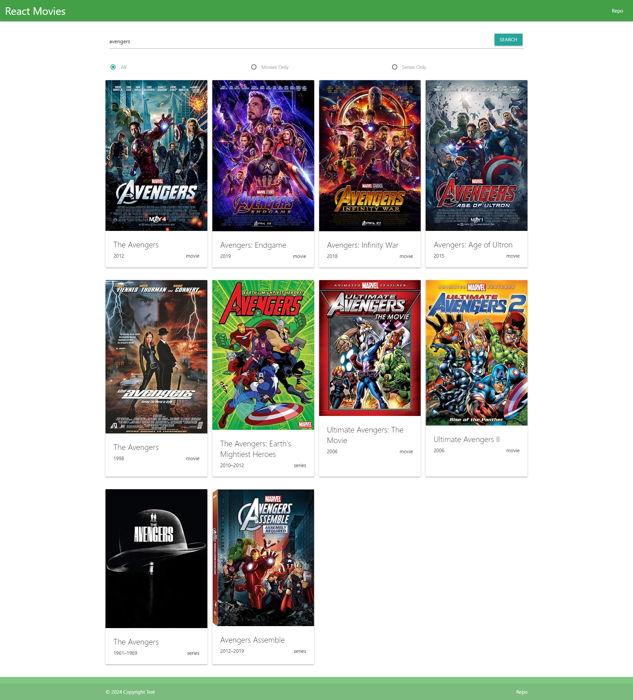

## React приложение по поиску фильмов/сериалов

- ### Проект доступен по ссылке - https://vadim-strakhov.github.io/react_movies_project/
- ### В проекте использован бесплатный API - https://www.omdbapi.com/
- ### В проекте реализован функционал поиска фильмов и сериалов с фильтрацией по категории. Названия следует писать на английском языке
- ### Технологии - `react`, `css`, `typescript`, `materialize-css`

